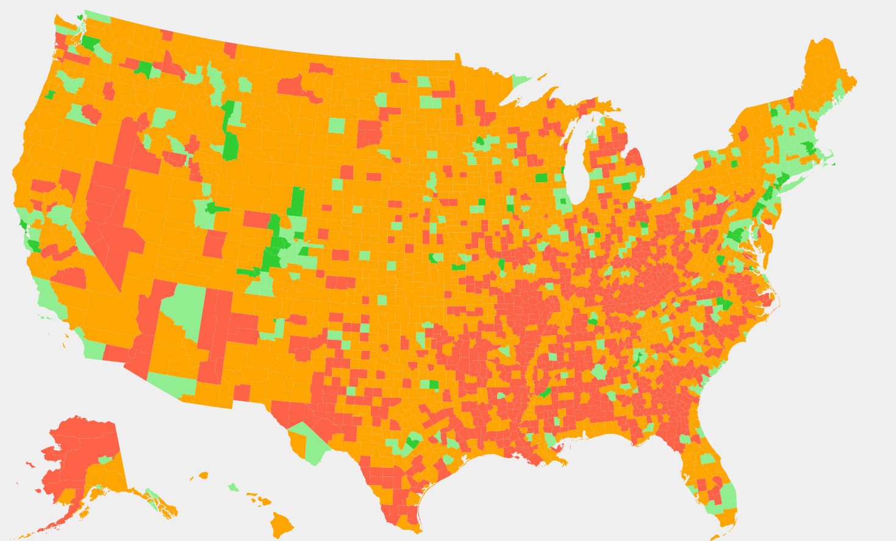
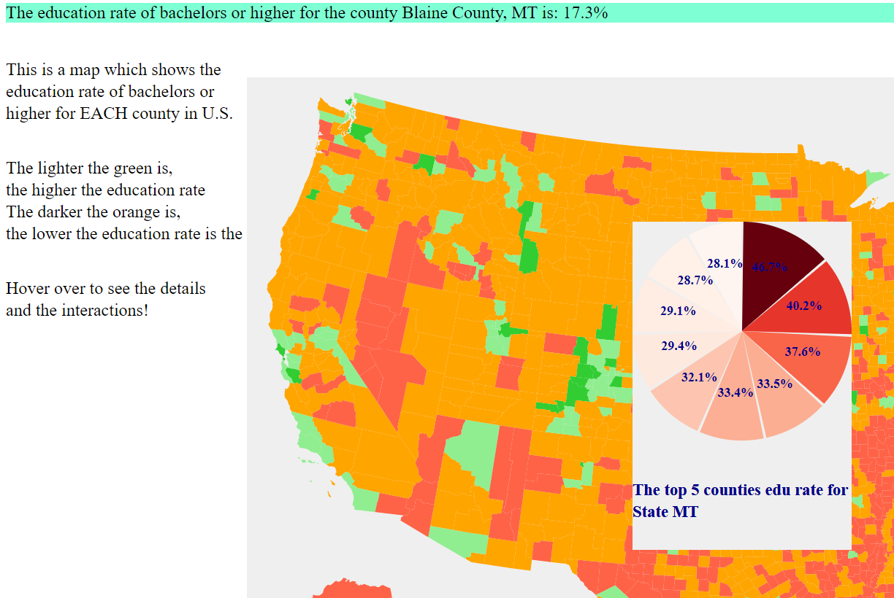
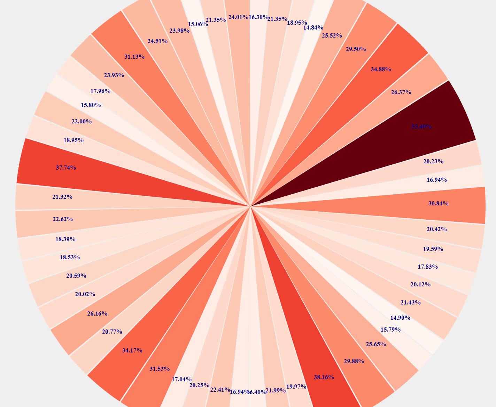
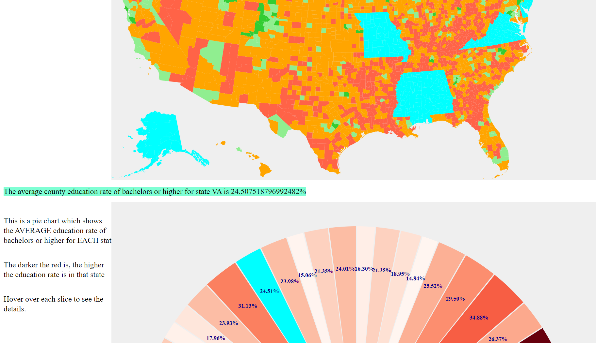
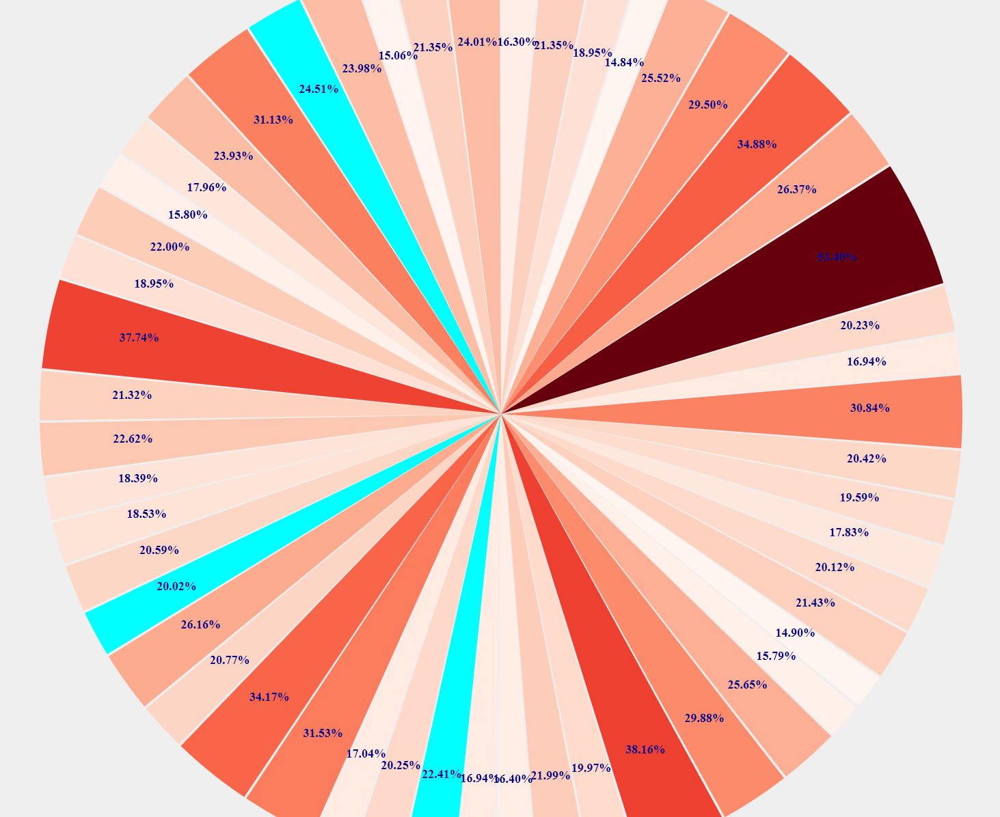

Assignment 4 - DataVis Remix + Multiple Views
===

Link: https://xchen0326.github.io/04-Remix/

The following picture is the original vis that I chose to work on:

It shows the education rate of bachelors or higher in each 
county in U.S. However, from this vis, we can only get a rough
understanding about the data from the color and the county boundaries.
Other than that, we are not able to get details.

To make it better, I made it possible for users to view the data
when they hover over a county. There is a tooltip at the upper-left
corner, telling the user about the education rate detail and which
county the user is looking at. There is also a tooltip svg that
contains a small pie chart inside. The small pie chart tells the
 user about the top five counties' education rate in the State
  which the user is hovering over.

Besides what I have introduced, I created another linked view
 for the map. My linked view is a big pie chart, which shows below:

However, it does tells a slightly different story from the map.
The big pie chart shows the AVERAGE education rate of bachelors
or higher for each State. Because the data source does not include
all the counties in U.S., instead, it picks several counties for
each state, the only way to make the evaluation most accurate
is to show the average rate for each State instead of using the total.
The big pie chart has a notation on each slice that directly
tells the user about the data for each state. By hovering over
each slice, there will also be a tooltip at the upper-left corner
about the details.

My interaction is about color change. If the user hovers over
the map, the slice of the big pie chart that corresponds to 
the state that the user is hovering at will change its color to
Cyan. In this way, the user can scroll down to the big pie chart
and take a closer look about it, vice versa.

The data source is included in the data_resource.txt.

## Design Achievement:
I scaled the color for pie charts. The darker the red is, the
higher the education rate the slice represents. Dark colors
tend to have a deeper impression on people, so when they look
at the pie charts, they will immediately know which education rate
is big and which is small.

## Technical Achievement:
I added the small pie chart as a tooltip that will only appear
when the user hovers over a county, and its position depends
on the mouse. This additional small pie chart gathers additional
information (top five counties in the same State as the county
 that the user hovers over). It can be taken as a bonus.

